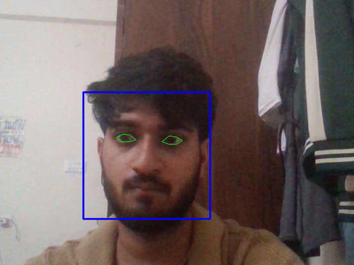
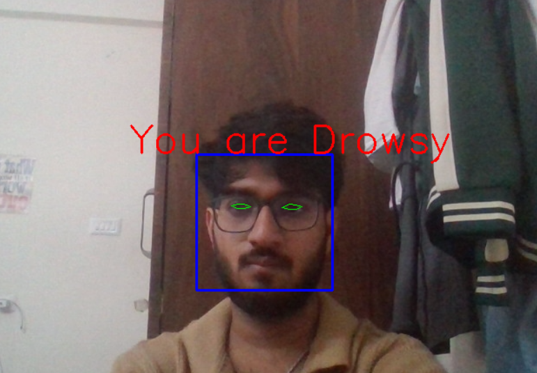

# 🚗 Driver Drowsiness Detection System

---

## 📌 Overview

This project detects **driver drowsiness in real-time** using computer vision techniques.
It monitors the user's eye movement through a webcam and triggers an **alarm alert** if the eyes remain closed beyond a certain threshold.

---

## 🚀 Features

* Real-time face detection
* Eye tracking using facial landmarks
* Drowsiness detection using Eye Aspect Ratio (EAR)
* Alarm system using pygame
* Works with live webcam feed

---

## 📂 Project Files

* **face_and_eye_detector_single_image.py**
  Detects face and eyes from a single image

* **face_and_eye_detector_webcam_video.py**
  Detects face and eyes in real-time webcam feed

* **drowsiness_detect.py**
  Main script to detect drowsiness and trigger alert

---

## 🖼️ Output Screenshots

### 🔹 Input vs Output

| Input Image                | Output Image                 |
| -------------------------- | ---------------------------- |
|  |  |


## ⚙️ Requirements

Install all dependencies:

```bash
pip install opencv-python numpy imutils scipy pygame dlib-bin
```

---

## ⚠️ Important Setup

Download the facial landmark model file:

http://dlib.net/files/shape_predictor_68_face_landmarks.dat.bz2

Steps:

1. Download the file
2. Extract it
3. Place `shape_predictor_68_face_landmarks.dat` in the project root folder

---

## ▶️ Usage

### 1. Detect Face & Eyes (Single Image)

```bash
python face_and_eye_detector_single_image.py
```

---

### 2. Detect Face & Eyes (Webcam)

```bash
python face_and_eye_detector_webcam_video.py
```

---

### 3. Run Drowsiness Detection

```bash
python drowsiness_detect.py
```

---

## 🧠 Algorithm Used

* Eye Aspect Ratio (EAR) for detecting eye closure
* Facial landmark detection using dlib

---

## 📈 Future Improvements

* Add yawning detection
* Improve accuracy using deep learning
* Integrate with mobile or web dashboard
* Use modern frameworks like MediaPipe

---

## 👨‍💻 Author

**Abhishek Soni**
Enthusiast SDE 1
---
